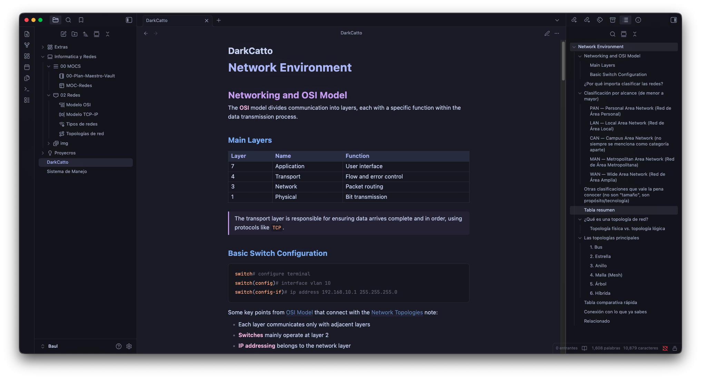
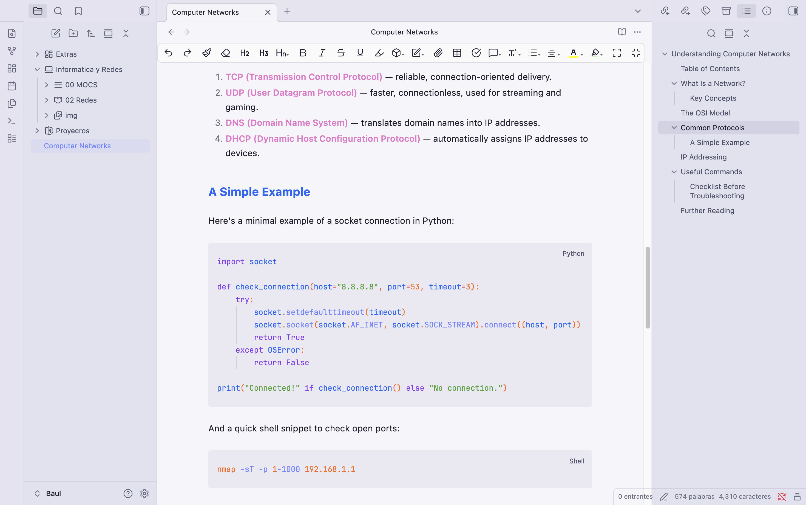

# DarkCatto

A theme for Obsidian based on the **Catppuccin** color palette, now available in two versions: **DarkCatto** (dark mode) and **WhiteCatto** (light mode), both within the same theme.

## What's New

**WhiteCatto** has been added, a light mode version that keeps the same aesthetic, color palette, and fonts as the original dark mode, adapted to a white background without losing the theme's visual identity.

## Available Modes

- **DarkCatto**: dark mode, inspired by the Catppuccin Mocha palette.
- **WhiteCatto**: light mode, carrying the same visual essence of DarkCatto adapted to lighter tones.

You can switch between both modes directly from Obsidian's appearance settings.

## License

This theme is licensed under the MIT License. See the LICENSE file for more details.
